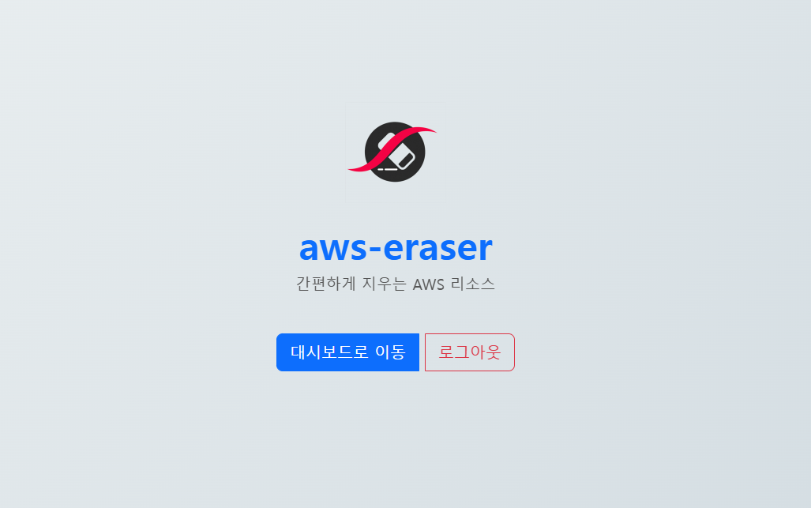
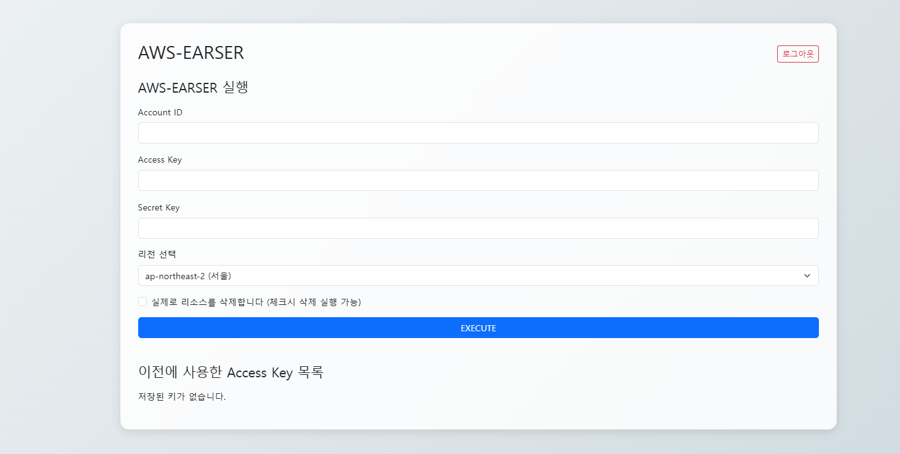

# 🧹 aws-eraser

 - URI: https://aws-earser.kro.kr/

A web-based tool that helps users securely **wipe AWS resources** with support for dry-run, actual deletion, and resource logs.  
Built for multi-user environments with individual key management, execution history, and simple interface.

---

## ✨ Features

- ✅ User registration & login (with security code)
- 🔐 Encrypted storage of AWS access & secret keys
- 🌍 Region selection via dropdown (e.g., `ap-northeast-2`, `us-east-1`)
- 💣 Execute real deletion with confirmation
- 📦 Run status tracking (`in progress`, `done`, etc.)
- 📜 Execution logs view
- 🗃️ Manage & delete previously used access keys

---

## 🛠️ Tech Stack

| Category        | Stack                     |
|-----------------|---------------------------|
| Language        | PHP 8.2                   |
| Frontend        | HTML5 + Bootstrap 5       |
| Backend         | PHP-FPM + MySQL           |
| Infra           | Docker, Nginx             |

---

